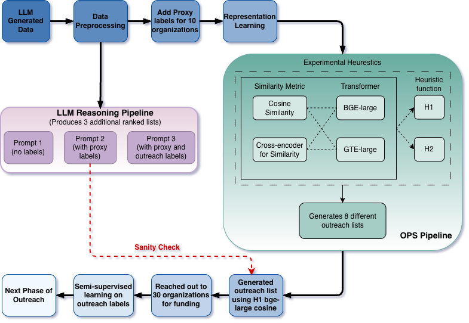

# IterLight Outreach Priority Score (OPS)

## Overview

This repo implements an **Outreach Priority Scoring (OPS)** framework for **[IterLight](https://iterlight.com/)** (EdTech) to decide **which funders to contact first** under **extreme label scarcity**. Instead of relying on a fully supervised model upfront (few reliable labels and almost no true negatives), OPS builds an **interpretable, expected-value style ranking** by combining:

- **Mission alignment** from transformer embeddings of mission statements
- **Latent neighborhood structure** from clustering (to generalize from a small proxy-success set)
- **Grant capacity** from standardized grant-size ranges

The output is a set of ranked outreach lists (multiple heuristic variants) plus a lightweight supervised calibration step that can refine engagement estimation after early outreach outcomes are collected.

---

## Pipeline

  

1. **LLM Generated Data → Data Preprocessing**

- Start with a high-recall candidate list.
- Clean/standardize structured fields (typical grant min/max) and compute expected capacity **μ(x)**.
- Clean mission text (`mission_clean`) and add structured feasibility signals (e.g., **Geo_Focus**).

2. **Add Proxy Labels (10 organizations)**

- Mark a small set of **proxy-success** funders (known EdTech-aligned) to provide weak supervision without assuming reliable negatives.

3. **Representation Learning**

- Embed mission text using transformer embeddings.
- Use UMAP + clustering (e.g., HDBSCAN) to recover latent thematic neighborhoods.
- Use proximity to proxy-success regions to build cluster-level priors used in scoring.

4. **OPS Pipeline → Experimental Heuristics**

- Generate **8 different outreach lists** by varying:
  - similarity metric (cosine vs cross-encoder),
  - embedding backbone (BGE-Large vs BTE-Large),
  - heuristic function (H1 vs H2).

5. **LLM Reasoning Pipeline (3 additional ranked lists)**

- Prompt 1: no labels
- Prompt 2: with proxy labels
- Prompt 3: with proxy + outreach labels  
  These lists are complementary “semantic reasoning” perspectives and a sanity-check alongside OPS.

6. **Outreach → Semi-supervised calibration → Next outreach**

- Run real outreach using a fixed OPS list (baseline).
- Use outreach outcomes (responses) to fit a **constrained logistic regression** that calibrates engagement into **p̂(x)**.
- Use calibrated EV ranking for the next outreach phase.

---

## Experimental Heuristics

| Sr. | Heuristic | Embedding | Similarity    | OPS Form             |
| --: | :-------: | --------- | ------------- | -------------------- |
|   1 |    H1     | BGE-Large | Cosine        | p(x) · μ(x)          |
|   2 |    H1     | BTE-Large | Cosine        | p(x) · μ(x)          |
|   3 |    H1     | BGE-Large | Cross-Encoder | p(x) · μ(x)          |
|   4 |    H1     | BTE-Large | Cross-Encoder | p(x) · μ(x)          |
|   5 |    H2     | BGE-Large | Cosine        | p(x) · log(1 + μ(x)) |
|   6 |    H2     | BTE-Large | Cosine        | p(x) · log(1 + μ(x)) |
|   7 |    H2     | BGE-Large | Cross-Encoder | p(x) · log(1 + μ(x)) |
|   8 |    H2     | BTE-Large | Cross-Encoder | p(x) · log(1 + μ(x)) |

**Interpretation**

- **H1** uses raw expected grant capacity μ(x) (simple EV-style prioritization).
- **H2** uses log(1 + μ(x)) to reduce domination by extremely large grant sizes.
- Embedding + similarity choices test whether top recommendations are stable to representation decisions.

---

## Results

### 1) Stable top-tier recommendations across 8 lists

Across the 8 OPS variants, the **highest-priority tier remains stable** (high overlap among top-ranked organizations), indicating the shortlist is robust rather than fragile to modeling choices.

### 2) Outreach sanity-check + supervised refinement

We ran real outreach using a **fixed baseline OPS list**. Responses concentrated in higher tiers (directional consistency check; not a claim of predictive accuracy).  
Only after this first outreach round do we introduce supervision: a constrained logistic regression calibrates engagement into **p̂(x)**, producing a refined expected-value ranking for the next outreach phase.

### 3) LLM-based ranked lists are complementary

The three LLM prompt variants produce additional ranked lists that provide a qualitative semantic lens (no labels → proxy labels → proxy + outreach labels) alongside OPS.

---
